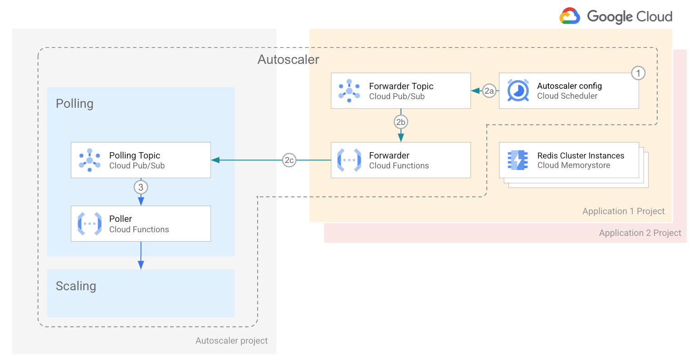

 

  <h2 align="center">OSS Memorystore Cluster Autoscaler</h2>
  

  

    <!-- In one sentence: what does the code in this directory do? -->
    Forward messages from Cloud Scheduler to the Poller function topic.
     
    <a href="../../README.md">Home</a>
    ·
    <a href="../poller/README.md">Poller component</a>
    ·
    <a href="../scaler/README.md">Scaler component</a>
    ·
    Forwarder component
    ·
    <a href="../../terraform/README.md">Terraform configuration</a>
    ·
    <a href="../../terraform/README.md#Monitoring">Monitoring</a>
  

## Table of Contents

*   [Table of Contents](#table-of-contents)
*   [Overview](#overview)
*   [Architecture](#architecture)
*   [Configuration parameters](#configuration-parameters)
    *   [Required](#required)

## Overview

The Forwarder function takes messages published to PubSub from Cloud Scheduler,
checks their JSON syntax and forwards them to the Poller PubSub topic. The topic
can belong to a different project from the Scheduler.

## Architecture

The Memorystore Cluster instances reside in a given application project.

1.  Cloud Scheduler lives in the same project as the Memorystore Cluster
    instances.

2.  Cloud Scheduler publishes its messages to the Forwarder topic in the same project.

3.  The Forwarder Cloud Function reads messages from the Forwarder topic, and

4.  Forwards them to the Polling topic. The Polling topic resides in a
    different project.

5.  The Poller function reads the messages from the polling topic and
    further continues the process as described in
    the [main architecture section](../../terraform/cloud-functions/README.md#architecture).

It is important to note that Autoscaler infrastructure is now distributed across
several projects. *The core components reside in the Autoscaler project* An
instance of Cloud Scheduler, the Forwarder topic and the Forwarder Function
reside in each of the application projects.

## Configuration parameters

Using the Forward function forwards to the PubSub specified in the environment
variable `POLLER_TOPIC`.

### Required

| Key            | Description |
| -------------- | ------------------------------------------- |
| `POLLER_TOPIC` | PubSub topic the Poller function listens on |
