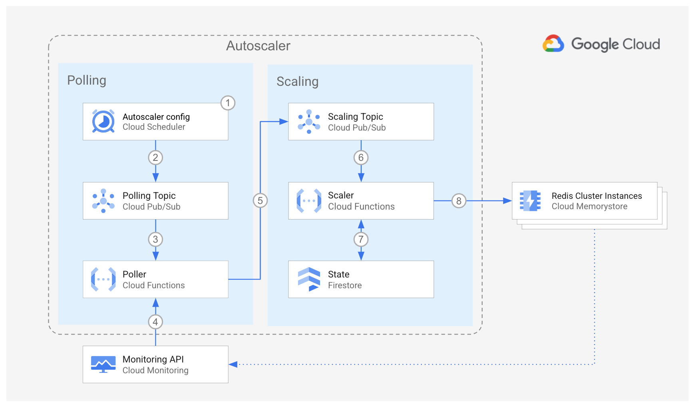

<br />
<p align="center">
  <h2 align="center">OSS Memorystore Cluster Autoscaler</h2>
  

  <p align="center">
    <!-- In one sentence: what does the code in this directory do? -->
    Set up the Autoscaler in Cloud Run functions in a per-project
    deployment using Terraform
    <br />
    <a href="../../../README.md">Home</a>
    ·
    <a href="../../../src/scaler/README.md">Scaler component</a>
    ·
    <a href="../../../src/poller/README.md">Poller component</a>
    ·
    <a href="../../../src/forwarder/README.md">Forwarder component</a>
    ·
    Terraform configuration
    ·
    <a href="../README.md#Monitoring">Monitoring</a>
    <br />
    Cloud Run functions
    ·
    <a href="../../gke/README.md">Google Kubernetes Engine</a>
    <br />
    Per-Project
    ·
    <a href="../centralized/README.md">Centralized</a>
    ·
    <a href="../distributed/README.md">Distributed</a>

  </p>

</p>

## Table of Contents

*   [Table of Contents](#table-of-contents)
*   [Overview](#overview)
*   [Architecture](#architecture)
    *   [Pros](#pros)
    *   [Cons](#cons)
*   [Before you begin](#before-you-begin)
*   [Preparing the Autoscaler Project](#preparing-the-autoscaler-project)
    *   [Using Firestore for Autoscaler state](#using-firestore-for-autoscaler-state)
    *   [Using Spanner for Autoscaler state](#using-spanner-for-autoscaler-state)
*   [Deploying the Autoscaler](#deploying-the-autoscaler)
*   [Connecting to the test VM](#connecting-to-the-test-vm)
*   [Importing your Memorystore Cluster instances](#importing-your-memorystore-cluster-instances)
*   [Next steps](#next-steps)

## Overview

This directory contains Terraform configuration files to quickly set up the
infrastructure for your Autoscaler with a per-project deployment.

In this deployment option, all the components of the Autoscaler
reside in the same project as your Memorystore Cluster instances.

This deployment is ideal for independent teams who want to self-manage the
infrastructure and configuration of their own Autoscalers. It is also a good
entry point for testing the Autoscaler capabilities.

## Architecture



For an explanation of the components of the Autoscaler and the
interaction flow, please read the
[main Architecture section](../README.md#architecture).

The per-project deployment has the following pros and cons:

### Pros

*   **Design**: This option has the simplest design.
*   **Configuration**: The control over scheduler parameters belongs to the team
    that owns the Memorystore clusters, therefore the team has the highest
    degree of freedom to adapt the Autoscaler to its needs.
*   **Infrastructure**: This design establishes a clear boundary of
    responsibility and security over the Autoscaler infrastructure because the
    team that owns the Memorystore clusters is also the owner of the Autoscaler
    infrastructure.

### Cons

*   **Maintenance**: With each team being responsible for the Autoscaler
    configuration and infrastructure it may become difficult to make sure that
    all Autoscalers across the organization follow the same update guidelines.
*   **Audit**: Because of the high level of control by each team, a centralized
    audit may become more complex.

## Before you begin

In this section you prepare your project for deployment.

1.  Open the [Cloud Console][cloud-console]
2.  Activate [Cloud Shell][cloud-shell] \
    At the bottom of the Cloud Console, a
    <a href='https://cloud.google.com/shell/docs/features'>Cloud Shell</a>
    session starts and displays a command-line prompt. Cloud Shell is a shell
    environment with the Cloud SDK already installed, including the
    <code>gcloud</code> command-line tool, and with values already set for your
    current project. It can take a few seconds for the session to initialize.

3.  In Cloud Shell, clone this repository:

    ```sh
    git clone https://github.com/GoogleCloudPlatform/memorystore-cluster-autoscaler.git
    ```

4.  Change into the directory of the cloned repository, and check out the
    `main` branch:

    ```sh
    cd memorystore-cluster-autoscaler && git checkout main
    ```

5.  Export a variable for the working directory:

    ```sh
    export AUTOSCALER_DIR="$(pwd)/terraform/cloud-functions/per-project"
    ```

## Preparing the Autoscaler Project

In this section you prepare your project for deployment.

1.  Go to the [project selector page][project-selector] in the Cloud Console.
    Select or create a Cloud project.

2.  Make sure that billing is enabled for your Google Cloud project.
    [Learn how to confirm billing is enabled for your project][enable-billing].

3.  In Cloud Shell, set environment variables with the ID of your **autoscaler**
    project:

    ```sh
    export PROJECT_ID=<YOUR_PROJECT_ID>
    gcloud config set project "${PROJECT_ID}"
    ```

4.  Choose the [region][region-and-zone] where the Autoscaler infrastructure
    will be located.

    ```sh
    export REGION=us-central1
    ```

5.  Enable the required Cloud APIs

    ```sh
    gcloud services enable \
      artifactregistry.googleapis.com \
      cloudbuild.googleapis.com \
      cloudfunctions.googleapis.com \
      cloudresourcemanager.googleapis.com \
      cloudscheduler.googleapis.com \
      compute.googleapis.com \
      eventarc.googleapis.com \
      iam.googleapis.com \
      networkconnectivity.googleapis.com \
      memorystore.googleapis.com \
      pubsub.googleapis.com \
      logging.googleapis.com \
      monitoring.googleapis.com \
      redis.googleapis.com \
      run.googleapis.com \
      serviceconsumermanagement.googleapis.com
    ```

6.  There are two options for deploying the state store for the Autoscaler:

    1.  Store the state in [Firestore][cloud-firestore]
    2.  Store the state in [Spanner][cloud-spanner]

    For Firestore, follow the steps in
    [Using Firestore for Autoscaler State](#using-firestore-for-autoscaler-state).
    For Spanner, follow the steps in [Using Spanner for Autoscaler state](#using-spanner-for-autoscaler-state).

### Using Firestore for Autoscaler state

1.  To use Firestore for the Autoscaler state, enable the additional API:

    ```sh
    gcloud services enable firestore.googleapis.com
    ```

2.  If you want to choose the name for your Firestore database, set the
    following variable:

    ```sh
    export TF_VAR_firestore_state_database=<DATABASE_NAME>
    ```

    If you do not set this variable, the default database will be used
    (`(default)`).

3.  Next, continue to [Deploying the Autoscaler](#deploying-the-autoscaler).

### Using Spanner for Autoscaler state

1.  To use Spanner for the Autoscaler state, enable the additional API:

    ```sh
    gcloud services enable spanner.googleapis.com
    ```

2.  If you want Terraform to create a Spanner instance (named
    `memorystore-autoscaler-state` by default) to store the state,
    set the following variable:

    ```sh
    export TF_VAR_terraform_spanner_state=true
    ```

    If you already have a Spanner instance where state must be stored,
    set the the name of your instance:

    ```sh
    export TF_VAR_spanner_state_name=<SPANNER_INSTANCE_NAME>
    ```

    If you want to manage the state of the Autoscaler in your own
    Cloud Spanner instance, please create the following table in advance:

    ```sql
    CREATE TABLE memorystoreClusterAutoscaler (
      id STRING(MAX),
      lastScalingTimestamp TIMESTAMP,
      createdOn TIMESTAMP,
      updatedOn TIMESTAMP,
      lastScalingCompleteTimestamp TIMESTAMP,
      scalingOperationId STRING(MAX),
      scalingRequestedSize INT64,
      scalingPreviousSize INT64,
      scalingMethod STRING(MAX),
    ) PRIMARY KEY (id)
    ```

3.  Next, continue to [Deploying the Autoscaler](#deploying-the-autoscaler).

## Deploying the Autoscaler

1.  Set the project ID and region in the corresponding Terraform
    environment variables:

    ```sh
    export TF_VAR_project_id="${PROJECT_ID}"
    export TF_VAR_region="${REGION}"
    ```

2.  By default, a new Memorystore Cluster instance will be created for testing.
    If you want to scale an existing Memorystore Cluster instance, set the
    following variable:

    ```sh
    export TF_VAR_terraform_memorystore_cluster=false
    ```

    Set the following variable to choose the name of a new or existing cluster
    to scale:

    ```sh
    export TF_VAR_memorystore_cluster_name=<memorystore-cluster-name>
    ```

    If you do not set this variable, `autoscaler-target-memorystore-cluster`
    will be used.

    For more information on how to configure your cluster to be managed by
    Terraform, see [Importing your Memorystore Cluster instances](#importing-your-memorystore-cluster-instances).

3.  To create a testbench VM with utilities for testing Memorystore, including
    generating load, set the following variable:

    ```sh
    export TF_VAR_terraform_test_vm=true
    ```

    Note that this option can only be selected when you have chosen to create a
    new Memorystore cluster.

4.  Change directory into the Terraform per-project directory and initialize it.

    ```sh
    cd "${AUTOSCALER_DIR}"
    terraform init
    ```

5.  Create the Autoscaler infrastructure. Answer `yes` when prompted, after
    reviewing the resources that Terraform intends to create.

    ```sh
    terraform apply -parallelism=2
    ```

    *   If you are running this command in Cloud Shell and encounter errors of
        the form "`Error: cannot assign requested address`", this is a [known
        issue][provider-issue] in the Terraform Google provider, please retry
        the command above and include the flag `-parallelism=1`.

## Connecting to the Test VM

To connect to the optionally created test VM, run the following command:

```sh
function memorystore-testbench-ssh {
  export TEST_VM_NAME=$(terraform output -raw test_vm_name)
  export TEST_VM_ZONE=$(terraform output -raw test_vm_zone)
  export PROJECT_ID=$(gcloud config get-value project)
  gcloud compute ssh --zone "${TEST_VM_ZONE}" "${TEST_VM_NAME}" --tunnel-through-iap --project "${PROJECT_ID}"
}
```

You can then use `memorystore-testbench-ssh` to SSH to the testbench VM via [IAP][iap].

## Importing your Memorystore Cluster instances

If you have existing Memorystore Cluster instances that you want to
[import to be managed by Terraform][terraform-import], follow the instructions
in this section.

1.  List your Memorystore clusters:

    ```sh
    gcloud redis clusters list --format="table(name)"
    ```

2.  Set the following variable with the instance name from the output of the
    above command that you want to import

    ```sh
    MEMORYSTORE_CLUSTER_NAME=<YOUR_MEMORYSTORE_CLUSTER_NAME>
    ```

3.  Create a Terraform config file with an empty
    [`google_redis_cluster`][terraform-redis-cluster] resource:

    ```sh
    echo "resource \"google_redis_cluster\" \"${MEMORYSTORE_CLUSTER_NAME}\" {}" > "${MEMORYSTORE_CLUSTER_NAME}.tf"
    ```

4.  [Import][terraform-import-usage] the Memorystore Cluster instance into the Terraform
    state.

    ```sh
    terraform import "google_redis_cluster.${MEMORYSTORE_CLUSTER_NAME}" "${MEMORYSTORE_CLUSTER_NAME}"
    ```

5.  After the import succeeds, update the Terraform config file for your
    instance with the actual instance attributes

    ```sh
    # TODO fields to exclude
    terraform state show -no-color "google_redis_cluster.${MEMORYSTORE_CLUSTER_NAME}" \
      | grep -vE "(id|state).*(=|\{)" \
      > "${MEMORYSTORE_CLUSTER_NAME}.tf"
    ```

If you have additional Memorystore clusters to import, repeat this process.

## Next steps

Your Autoscaler infrastructure is ready, follow the instructions in the main
page to [configure your Autoscaler](../README.md#configuration).

<!-- LINKS: https://www.markdownguide.org/basic-syntax/#reference-style-links -->

[cloud-console]: https://console.cloud.google.com
[cloud-firestore]: https://cloud.google.com/firestore
[cloud-shell]: https://console.cloud.google.com/?cloudshell=true
[cloud-spanner]: https://cloud.google.com/spanner
[enable-billing]: https://cloud.google.com/billing/docs/how-to/modify-project
[iap]: https://cloud.google.com/security/products/iap
[project-selector]: https://console.cloud.google.com/projectselector2/home/dashboard
[provider-issue]: https://github.com/hashicorp/terraform-provider-google/issues/6782
[region-and-zone]: https://cloud.google.com/compute/docs/regions-zones#locations
[terraform-import-usage]: https://www.terraform.io/docs/import/usage.html
[terraform-import]: https://www.terraform.io/docs/import/index.html
[terraform-redis-cluster]: https://registry.terraform.io/providers/hashicorp/google/latest/docs/resources/redis_cluster
